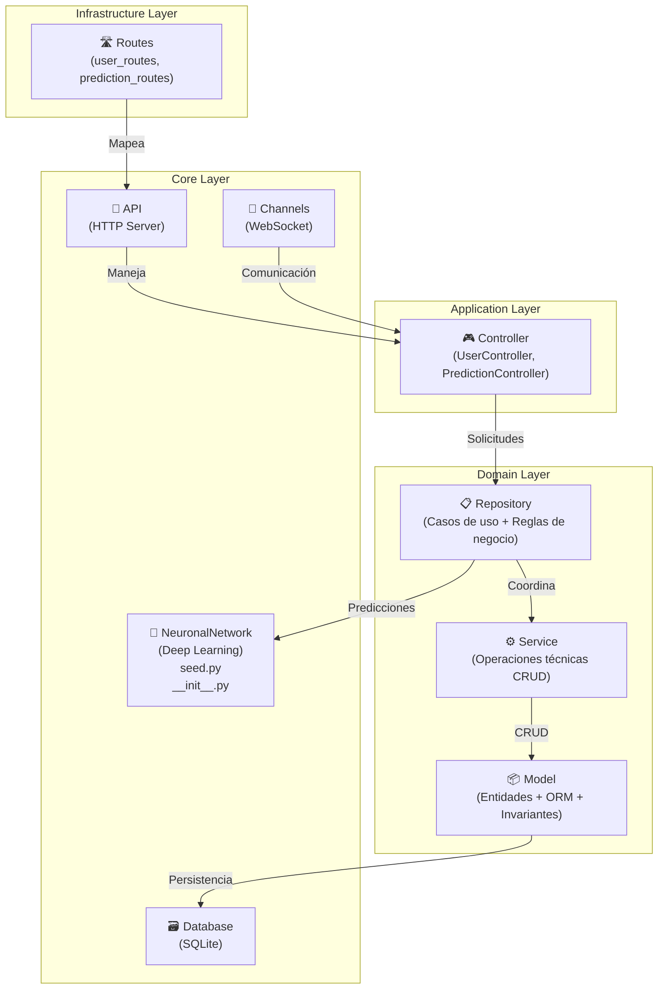
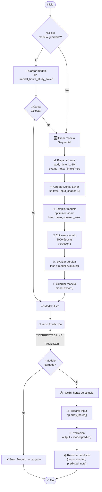

# 🧠 BasiNeuronalNetwork

**Red Neuronal para Predicción de Calificaciones** - Una aplicación que utiliza TensorFlow/Keras para predecir notas de examen basadas en horas de estudio, con una arquitectura  Hexagonal.

---

## 📦 ¿Qué es esta Aplicación?

BasiNeuronalNetwork es una plataforma que:
- **Entrena** una red neuronal con datos de estudio y calificaciones
- **Predice** notas de examen basadas en horas de estudio
- **Estructura** el código usando Clean Architecture (Controllers → Repository → Service → Model)
- **Persiste** datos en SQLite y modelos entrenados en SavedModel format

---

## ⚙️ Instalación (Python 3.11)

### 1️⃣ **Crear el Entorno Virtual**

```powershell
py -3.11 -m venv ./env
```

### 2️⃣ **Activar el Entorno Virtual**

**Windows (PowerShell):**
```powershell
./env/Scripts/Activate.ps1
```

**Windows (CMD):**
```cmd
./env/Scripts/activate.bat
```

**Linux/Mac:**
```bash
source env/bin/activate
```

### 3️⃣ **Instalar Dependencias**

```powershell
pip install -r requirements.txt
```

### 4️⃣ **Verificar Instalación**

```powershell
python -c "import tensorflow as tf; print(f'TensorFlow {tf.__version__} ✅')"
```

### 5️⃣ **Ejecutar la Aplicación**

```powershell
python -m src
```

---

## 📋 Dependencias Principales

| Paquete | Versión | Propósito |
|---------|---------|-----------|
| **tensorflow** | 2.20.0 | Framework de Deep Learning |
| **keras** | 3.12.0 | API de redes neuronales |
| **numpy** | 2.3.5 | Operaciones numéricas |
| **h5py** | 3.15.1 | Guardado/carga de modelos |
| **requests** | 2.32.5 | Solicitudes HTTP |
| **rich** | 14.2.0 | Outputs con estilo en terminal |

---

## 🗂️ Estructura del Proyecto

```
BasiNeuronalNetwork/
├── src/
│   ├── __main__.py              # Punto de entrada
│   ├── Application/
│   │   └── Controller/          # Adaptadores HTTP
│   ├── Core/
│   │   ├── Api/                 # Servidor HTTP
│   │   ├── Database/            # SQLite
│   │   ├── Logger/              # Logging
│   │   ├── Channels/            # WebSocket
│   │   └── NeuronalNetwork/     # Red neuronal
│   │       ├── seed.py          # Entrenamiento
│   │       └── __init__.py      # Predicción
│   ├── Domain/
│   │   ├── Model/               # Entidades
│   │   ├── Service/             # Operaciones técnicas
│   │   └── Repository/          # Lógica de negocio
│   └── Infrastructure/
│       └── Routes/              # Definición de endpoints
├── model_hours_study_saved/     # Modelo entrenado
├── uploads/                     # Archivos subidos
├── env/                         # Entorno virtual
├── requirements.txt             # Dependencias
└── README.md                    # Esta documentación
```

---

## Generalización de Términos

1. **Channel** -> Habla de una conexión WebSocket

2. **Model** -> Define la estructura de datos (Molde) que se va usar (Objeto con sus atributos), Es decir su Estado y reglas invariantes.
3. **Repository** -> Se encarga de aplicar la Entidad/Modele y definir los métodos que se van a usar, Es decir una Interfaz de acceso a las Entidades/Modelos.
4. **Service** -> Se encarga de aplicar la lógica de negocio teniendo en cuenta el Modelo y Repositorio.
5. **Infrastructure** -> La base de datos, Framework, I/O.
6. **Hash** -> función matemática que convierte cualquier dato de entrada (texto, archivo, contraseña) en una cadena de caracteres de longitud fija.
7. **Salt** -> es un dato aleatorio único que se añade a una contraseña antes de aplicarle una función hash, creando un hash diferente incluso para contraseñas idénticas.

## **Diagramas**

### **Arquitectura del Sistema**



---

### **Diagrama de Flujo: Entrenamiento + Predicción**



# **Arquitectura simplificada**

```
 Controller / API          ← Application
        ↓
 Repository                ← Domain (reglas de negocio + casos de uso)
        ↓
 Service                   ← Domain (operaciones técnicas)
        ↓
 Model                     ← Domain (modelos + ORM + invariantes)
        ↓
 Database / Routes         ← Infrastructure (adaptadores externos)
```

---

# **Application**

Capa donde entran las solicitudes. Es un **adaptador de entrada**.

### **Controller**

```
project/Application/Controller/
│── UserController.py
└── PredictionController.py
```

Responsabilidades:

- Recibir la solicitud HTTP / WebSocket / CLI.
- Validar datos superficiales.
- Llamar al **Repositorio** (casos de uso).
- No implementa lógica de negocio ni reglas.

Ejemplo:
`UserController → UserRepository.register_user()`

---

# **Domain**

```
 Controller / API
        ↓
 Repository  ← reglas + casos de uso
        ↓
 Service     ← operaciones técnicas
        ↓
 Model       ← datos + persistencia
        ↓
 Database
```

Centro de la lógica del sistema.

## **Modelo**

```
project/Domain/Model/
│── User.py
└── Prediction.py
```

Define:

- Estructura del dominio.
- Reglas internas (invariantes).
- ValueObjects.

## **Repositorio**

```
project/Domain/Repository/
│── UserRepository.py
└── PredictionRepository.py
```

Responsabilidades:

- **Casos de uso** del negocio.
- Aplicar **validaciones y reglas**.
- Coordinar servicios.
- Hablar con los servicios técnicos para manejar datos.

Ejemplo:
`UserRepository.register_user(email, password)` → usa servicio técnico para guardar datos.

## **Servicio (Domain)**

```
project/Domain/Service/
│── UserService.py
└── PredictionService.py
```

Responsabilidades:

- Operaciones técnicas (CRUD genérico).
- Acceso a BD.
- Hashing, envío de emails, lectura de archivos, etc.

No contiene lógica del dominio.

---

# **Core**

Infraestructura interna reusable.

```
project/Core/
├── Api # HTTP Server
├── Model # ORM Base
├── Channels # ...XD
├── Singletons # Logger && Database
└── NeuronalNetwork # Deep Learning and get Model
```

Es la caja de herramientas del sistema.

---

# **Infrastructure**

Adaptadores externos + configuración de la app.

## **Rutas (Adaptador de salida)**

```
project/Infrastructure/Routes/
│── user_routes.py
└── prediction_routes.py
```

- Conecta HTTP → Controller.
- No contiene lógica.
- Define los endpoints y cómo se mapean.

## **Base de datos**

```
project/Core/Database/GlobalSqlite
```

- Es la implementación real.
- La capa Domain nunca debe importarla directamente.

---
